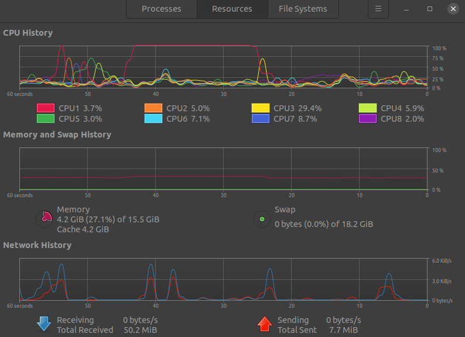
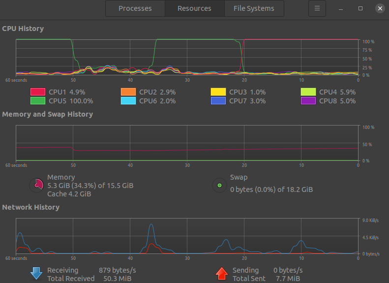

# Performance Analysis Report

We record the time and memory consumptions of core functions at `time_cost.cpp`.

## Experiment dataset 
Generated 2-d sample data. Loaded with our code as `std::vector<double>`.

### Size of dataset
- small: 1 thousand (1.8 kB)
- middle: 1 million (1.8 MB)
- large: 10 million (177.9 MB)

## Hardware & System Info

## Results

### Time cost with small dataset
- Time cost in loading data from csv: 0.00082s
- Time cost in constructing kd-tree: 0.000264s
- Time cost in finding minimum: 0.000032s
- Time cost in deleting tree: 0.000033s
- Total time: 0.002223s

### Time cost with middle dataset
- Time cost in loading data from csv: 0.135118s
- Time cost in constructing kd-tree: 0.175945s
- Time cost in finding minimum: 0.00014s
- Time cost in deleting tree: 0.00014s
- Total time: 0.017499s

### Time cost with large dataset
- Time cost in loading data from csv: 14.6284s
- Time cost in constructing kd-tree: 39.3877s
- Time cost in finding minimum: 0.000795s
- Time cost in deleting tree: 2.70185s
- Total time: 76.4677s

### Memory consumption with large dataset
We only record the memory consumption with large dataset for clearer view.

Use the command `gnome-system-monitor` to open system monitor on Ubuntu.

     

| Memory usage before runnig code| Memory usage while runnnig code |
| ------ | ------ |
| 4.2 GB | 5.3 GB (max) |

Before running the code, 4.2 GB memory was already used. During running, maximum 5.3 GB was used. Thus we know that the code takes 1.1 GB memory. This is mainly caused by loading data into memory and the `new` operations in constructing the tree.

## Diagrams on time cost

## Analysis
1. The slowest part of the code is to construct kd-tree from loaded data, which takes up about % % % while using the small, middle, large dataset respectively. It is caused by many `new` opeations during construction. We tried to replace them with smart pointers, but this introduces undesired issues in constructing that need more time for further invesitagion.

2. Loading data from csv file is the second slowest operation within the code. Futher improvement can be done by usling multi-thread techniques. 

3. Finding minimum is fast once the tree is successfully constructed. This proves the validaty of KD-Tree to fast data searching speed.

4. Finding the nearest neighbor is unfortunately unstable, which throws some segamentation fault sometimes depending on the target. We suspect that this is caused during the reverse search (climbing up to the tree root). However, due to time limits, we remain this question open. The time cost for finding the nearest neighbor is not included in the test_performance function.

## Future works
1. Invesitage into the `searchNN` function, especially in the reverse part for bug-shooting.
2. Use multi-thread methods for loading data (particularly for large dataset) from hard drives.
3. Develop another version with smart pointers in construct_tree, and compare its performance with traditional `new` and `delete` methods. As we can see, deleting the tree also needs some time :) But we are not sure which one is better in terms of time costs before any experiments.
